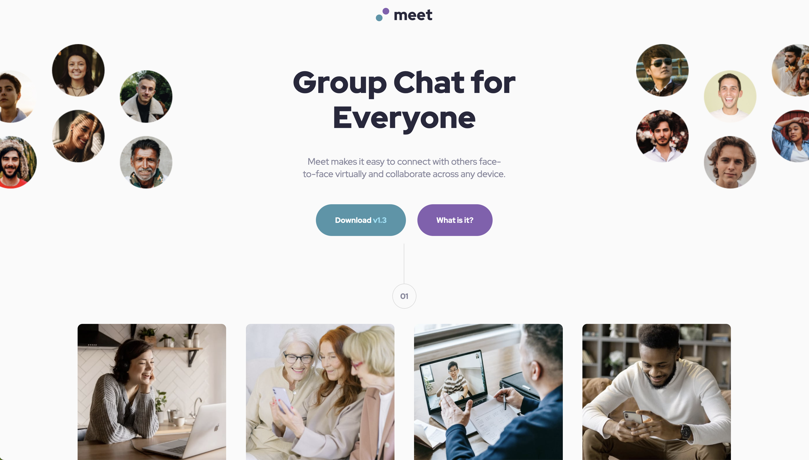

# Frontend Mentor - Product preview card component solution

This is a solution to the [Name of the challenge](https://www.url-of-the-challenge-on-frontend-mentor). Frontend Mentor challenges help you improve your coding skills by building realistic projects. 

## Table of contents

- [Overview](#overview)
  - [The challenge](#the-challenge)
  - [Screenshot](#screenshot)
  - [Links](#links)
- [My process](#my-process)
  - [Built with](#built-with)
  - [Self-Assessment](#Self-assessment)
    - [What I learnt](#What-I-learnt)
    - [What I am proud of](#What-I-am-proud-of)
    - [What I would do differently](#What-I-would-do-differently)
    - [Challenges](#Challenges)
    - [Help needed](#Help-needed)
    - [Continued development](#continued-development)

## Overview

### The challenge

Users should be able to:

- View the optimal layout depending on their device's screen size
- See hover and focus states for interactive elements

### Screenshot

### Links

- [Github Solution](https://github.com/RalphPastel972/meet-landing-page)
- [Live Site](https://ralphpastel972.github.io/meet-landing-page/)

## My process

### Built with

- Semantic HTML5 markup
- CSS custom properties
- Flexbox
- CSS Grid
- Mobile-first workflow

### Self-assessment

#### What I learnt

- Mobile first is definitely the way to go
- Some skills I thought I mastered already... well, I still needed a fair bit of practice to reach the result I wanted.

#### What I am proud of

Not much. I'm actually disapointed of myself on many aspects. The huge amount of time I needed to realise this design was surprising.

But I had fun juggling with the various layouts (flex, grid, block) to achieve my goals.

#### What I would do differently

Nothing, really.

#### Challenges

I struggled with the 4 images: what is the best layout to use and when.
I struggled having the image in the banner overflowing the container **without** getting scrollbars.

#### Help needed

n/a

#### Continued development

I will try to use Scss for the first time! I need to practice that.
For the moment I use online tools. I have nothing installed on my VS Code.
